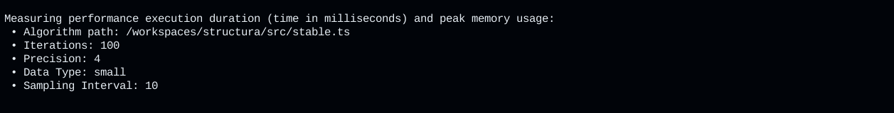
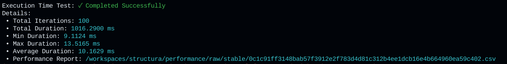
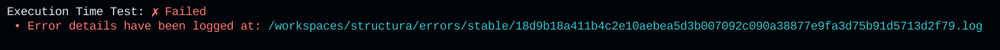
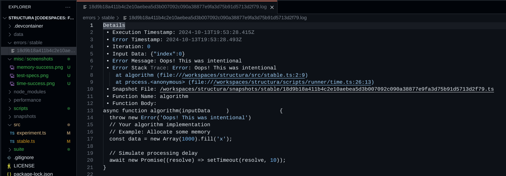

# Structura

**Structura** makes performance testing of algorithms in JavaScript and TypeScript accesible. By offering detailed performance metrics and error logging, it helps developers identify inefficiencies and errors in their code, facilitating continuous improvement and optimization.

The primary use of this project is to assist you in optimizing algorithms for speed or memory consumption. Structura provides you with the essentials to measure, compare, and understand the performance characteristics of your code.

## Features

- **Performance Metrics**:
  - Measure **execution time**: minimum, maximum, total duration, and average time across multiple iterations.
  - Measure **peak memory usage** during execution.
- **Detailed Error Logging**:
  - Log iteration-specific details, input data, stack traces, and algorithm information upon error occurrence.
- **Snapshot Management**:
  - Keep snapshots of the code being executed for historical reference, organized by version and unique content hash.
- **Terminal Feedback**:
  - Provide real-time feedback on test outcomes, including success details or error summaries, with links to the appropriate log files.

## Getting Started

### Project Setup

To get started with Structura, clone the repository and install the dependencies:

```bash
git clone https://github.com/AndrewRedican/structura.git
cd structura
npm install
```

### Generating Data

 Scripts to generate datasets for testing. These datasets are generated in JSON format and stored in the `./data` directory. By default, to keep the repository lean, this directory is excluded via `.gitignore`. Remove the `data` entry from `.gitignore` if you wish to commit your sample data to your remote repository.

 > **Note**: You can customize the data generation process by modifying [scripts/generateData.ts](scripts/generateData.ts) to fit your specific needs.

Generate datasets using the following commands:

- `npm run gd:small` — Generate **small** dataset (5,000 records).
- `npm run gd:standard` — Generate **standard** dataset (5,000 records).
- `npm run gd:complex` — Generate **complex** dataset (5,000 records).
- `npm run gd:varied` — Generate **varied** dataset (5,000 records).
- `npm run gd -- [type] [number]`  — Generate any custom dataset of _N_ amount of records.
Replace `[type]` with the either `small`, `standard`, `complex`, and `varied` or a custom value, and replace `[number]` with a number greater than `0`. For you custom data type to be used, you will have to modify [scripts/generateData/generators/index.ts](scripts/generateData/generators/index.ts) to fit your specific needs and include your own data generator.

### Testing your algorithm

Structura distinguishes between "stable" and "experimental" versions of algorithms. In reality, this is more of a _suggestion_, since technically you can target any TypeScript file under the source folder, provided you include the relative path or name with the `--algorithm` or `-a` (shorthand) flags.

- **Stable**: The version of your algorithm that is considered reliable and optimized. Place this code in [./src/stable.ts](./src/stable.ts).
- **Experimental**: The version under development or testing. Place this code in [./src/experiment.ts](./src/experiment.ts).

This separation allows you to compare the performance of different versions, following the scientific method by changing one specific aspect at a time.

#### Run Stable Code

To execute performance tests against the **stable** version of the algorithm:

```bash
  npm run measure -- -a stable -t -m -i 100 -p 4 -s 10 -d small
```

This will execute the code in [./src/stable.ts](./src/stable.ts).

#### Run Experimental Code

To execute performance tests against the **experimental** version of your algorithm:

```bash
npm run measure -- --algorithm experiment -t -m -i 200 -p 4 -s 10 -d complex
```

> Note: The `--algorithm` flag (or `-a` for short) specifies the target file to test. You can supply a relative path from the `src` folder or simply provide the filename directly under `src`. Specifying the `.ts` file extension is optional.

The framework will output performance metrics to the terminal and generate logs in the appropriate directories (`./performance`, `./snapshots`, and `./errors`).

#### CLI Options

| Option                      | Description                                                                                                  | Required                                 | Type             | Example Value    |
|-----------------------------|--------------------------------------------------------------------------------------------------------------|------------------------------------------|------------------|------------------|
| `-t`, `--time`              | Measure execution time                                                                                       | At least one of `-t` or `-m` is required | Flag (Boolean)   | N/A              |
| `-m`, `--memory`            | Measure memory usage                                                                                         | At least one of `-t` or `-m` is required | Flag (Boolean)   | N/A              |
| `-a`, `--algorithm`         | Path to the algorithm under test, relative to the root directory                                             | Yes                                      | String           | `experiment`     |
| `-i`, `--iterations`        | Number of iterations to run the algorithm                                                                    | Yes                                      | Positive integer | `100`            |
| `-p`, `--precision`         | Number of significant digits                                                                                 | Yes                                      | Positive integer | `4`              |
| `-s`, `--sampling-interval` | Time between memory usage samples in milliseconds                                                            | Required if `-m` is specified            | Positive integer | `10`             |
| `-d`, `--data-type`         | Type of data used for performance tests. Supported values: `small`, `standard`, `complex`, `varied`          | Yes                                      | String           | `small`           |

### Performance Testing Framework

The framework provides detailed logging for performance tests and error handling, facilitating thorough analysis and optimization.

### Snapshot Management

During execution, a snapshot of the code being tested is saved in the `./snapshots/{version}/{sha}` directory. Each snapshot is identified by a unique hash (SHA) and contains a copy of the code file being executed. This allows you to trace back to the exact version of the code that was run for any given test.

### Error Logging

If an error occurs during testing, an error log is generated in the `./errors/{version}/{sha}.log` file. The error log includes:

- Algorithm name
- Execution and error timestamps
- Iteration number where the error occurred
- Input data that led to the error
- Error message and stack trace
- Reference to the snapshot file
- Algorithm definition as a string for additional context

### Terminal Output

The terminal output displays the current specifications of the test being run, as well as the results:



The terminal output will also indicate whether the test completed successfully or encountered an error:

**Success:**



**Error:**





### Contributing

Contributions are welcome! Please follow these steps to contribute:

1. Fork the repository.
2. Create a new branch for your feature or bugfix.
3. Commit your changes with a descriptive message.
4. Open a pull request with a detailed description of your changes.

### Author Notes

Structura follows the philosophy of "Simple is best." The aim is to keep the framework lean and easy to understand. Here are some guiding principles:

- **Minimal Dependencies**: The use of third-party packages is kept to a minimum to avoid unnecessary complexity.
- **Node.js Version 22+**: The framework is designed to use the latest Node.js version (22+), which includes experimental TypeScript support.
- **Simplicity Over Convenience**: While convenience features are welcome, they must be weighed against the added complexity or potential dependencies.

### License

Structura is licensed under the Structura License 1.0.
TL;DR: Free for non-commercial use, with no warranty. Use at your own risk. See the [full license](/LICENSE).

### Professional Collaboration And Advanced Features

If you are interested in a more advanced version of Structura with full commercial licensing, algorithm versioning, or AI-integration for self-enhancement or automated unit tests, please reach out to the author.

- **Email**: [andrew.redican.mejia@gmail.com](mailto:andrew.redican.mejia@gmail.com)
- **LinkedIn**: [Andrew Redican](https://www.linkedin.com/in/andrewredican/)

We can discuss custom licensing options and how to extend the framework for your specific needs.

## Acknowledgements

This project makes use of the following third-party libraries:

- [Faker](https://github.com/faker-js/faker) - Licensed under the MIT License.
- [@types/node](https://github.com/DefinitelyTyped/DefinitelyTyped) - Licensed under the MIT License.
- [undici-types](https://github.com/nodejs/undici) - Licensed under the MIT License.
